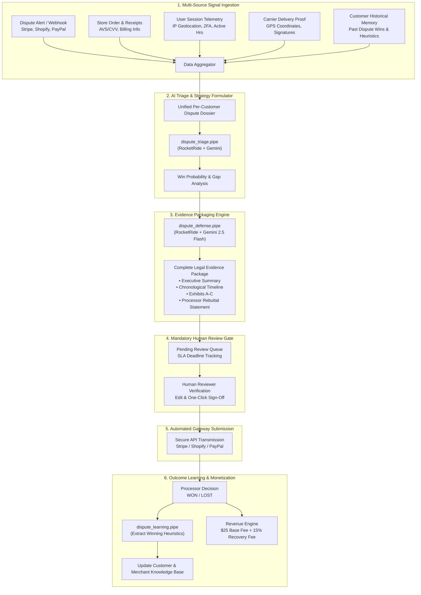

,# 🚀 DisputeRocket: Comprehensive AI Pipeline & System Overview

> **Project:** DisputeRocket — Autonomous Payment Dispute Defense & Evidence Packaging Platform  
> **Built For:** Rocket Ride Hackathon  
> **AI Engine:** RocketRide Pipeline Architecture + Google Gemini LLM (`gemini-2_5-flash`)

---

## 📑 Table of Contents

1. [Executive Summary & Problem Statement](#1-executive-summary--problem-statement)
2. [End-to-End Architecture & Workflow](#2-end-to-end-architecture--workflow)
3. [The RocketRide AI Pipelines (`.pipe` Files)](#3-the-rocketride-ai-pipelines-pipe-files)
4. [Multi-Source Data Aggregation & Correlation](#4-multi-source-data-aggregation--correlation)
5. [Google Gemini Evidence Synthesis & Exhibits](#5-google-gemini-evidence-synthesis--exhibits)
6. [Mandatory Human-in-the-Loop (HITL) Review Gate](#6-mandatory-human-in-the-loop-hitl-review-gate)
7. [Automated Gateway Submission & Deadline SLA](#7-automated-gateway-submission--deadline-sla)
8. [Outcome Ingestion & Continual Learning Loop](#8-outcome-ingestion--continual-learning-loop)
9. [Commercial Monetization & Billing Engine](#9-commercial-monetization--billing-engine)
10. [Verification, Health Checks & CLI Usage](#10-verification-health-checks--cli-usage)

---

## 1. Executive Summary & Problem Statement

### The Problem
Online stores and SaaS businesses lose **$100B+ annually** to payment chargebacks and disputes:
- **Scattered Evidence**: Crucial defense data is fragmented across checkout databases, user session telemetry, 2FA logs, and shipping carrier portals.
- **Tight Processor Deadlines**: Payment processors (Stripe, Shopify, PayPal, Adyen) enforce strict submission deadlines (often 7–14 days). Missed deadlines mean automatic loss of funds.
- **Generic / Weak Rebuttals**: Manually written dispute letters lack the precise formatting, network rule citations, and structured exhibit mappings demanded by card issuing banks (Visa, Mastercard, Amex).
- **Zero Learning Loop**: Prior wins and losses are rarely analyzed to improve future rebuttals.

### The Solution: DisputeRocket
**DisputeRocket** is an autonomous, end-to-end dispute defense system that ingests alerts, correlates multi-system customer signals, compiles legally formatted evidence packages using Google Gemini, enforces human review before submission, submits before the deadline, and continuously learns from resolution outcomes to maximize merchant recovery.

---

## 2. End-to-End Architecture & Workflow



---

## 3. The RocketRide AI Pipelines (`.pipe` Files)

DisputeRocket uses 4 dedicated RocketRide pipelines built in compliance with RocketRide DAG specifications (UUID identifiers, typed data lanes, and profile configurations):

```
                               ┌───────────────────┐
      Input Lane: 'questions'  │   chat source     │
           ───────────────────>│     (chat_1)      │
                               └─────────┬─────────┘
                                         │ 'questions' lane
                                         ▼
                               ┌───────────────────┐
                               │    llm_gemini     │  Profile: gemini-2_5-flash
                               │  (llm_gemini_1)   │  API Key: ${ROCKETRIDE_GEMINI_KEY}
                               └─────────┬─────────┘
                                         │ 'answers' lane
                                         ▼
                               ┌───────────────────┐
                               │ response_answers  │  Key: answers
                               │(response_answers_1│
                               └───────────────────┘
```

### Pipeline Specifications

| Pipeline File | Source Node | LLM Provider | Response Node | Purpose in Production |
| :--- | :--- | :--- | :--- | :--- |
| [`dispute_defense.pipe`](file:///Users/krishnakasaudhan/rocketride2/dispute_defense.pipe) | `chat` | `llm_gemini` (`gemini-2_5-flash`) | `response_answers` | Compiles full representment package, exhibits A–C, chronological timeline, and legal rebuttal letter. |
| [`dispute_triage.pipe`](file:///Users/krishnakasaudhan/rocketride2/dispute_triage.pipe) | `chat` | `llm_gemini` (`gemini-2_5-flash`) | `response_answers` | Analyzes incoming reason code, computes win probability (0–100%), and flags evidentiary gaps. |
| [`dispute_learning.pipe`](file:///Users/krishnakasaudhan/rocketride2/dispute_learning.pipe) | `chat` | `llm_gemini` (`gemini-2_5-flash`) | `response_answers` | Ingests final processor resolution (WON/LOST) and extracts winning tactics and risk updates. |
| [`chat.pipe`](file:///Users/krishnakasaudhan/rocketride2/chat.pipe) | `chat` | `llm_gemini` (`gemini-2_5-flash`) | `response_answers` | General-purpose interactive Q&A and investigation pipeline. |

---

## 4. Multi-Source Data Aggregation & Correlation

The [`DataAggregator`](file:///Users/krishnakasaudhan/rocketride2/data_aggregator.py) correlates 5 distinct data channels into a single unified customer defense payload:

1. **Dispute Alerts**: Dispute ID, disputed amount, currency, chargeback reason code (e.g., `10.4_FRAUD_CARD_ABSENT`, `13.1_MERCHANDISE_NOT_RECEIVED`), gateway, and evidence deadline.
2. **Order Records**: Transaction receipt, itemized cart, customer email/phone, card last 4 digits, billing address, and **AVS (Address Verification)** + **CVV matching verification**.
3. **Session Telemetry & SaaS Usage**: Originating IP address, device fingerprints, 2FA SMS/Authenticator confirmations, login timestamps, and cumulative SaaS active usage hours.
4. **Delivery & Fulfillment Proof**: Carrier tracking number (FedEx/UPS/DHL), delivery timestamp, recipient signature, and GPS coordinates.
5. **Customer Profile & Historical Record**: Lifetime customer value, past dispute history, prior win rate, and historically successful rebuttal arguments.

---

## 5. Google Gemini Evidence Synthesis & Exhibits

Powered by **Google Gemini** (`gemini-2_5-flash`), DisputeRocket produces an airtight, processor-ready representment package:

### Standard Generated Exhibits:
- **Exhibit A: Payment Authorization & AVS/CVV Verification**: Complete gateway token metadata proving cardholder identity and security matching.
- **Exhibit B: Authenticated Telemetry / Carrier Delivery Proof**:
  - *For SaaS*: Audit trails of authenticated login sessions, 2FA verification, API requests, and hours of dashboard usage post-purchase.
  - *For Physical Goods*: Carrier proof of delivery with tracking, GPS coordinates, and recipient signature.
- **Exhibit C: Terms of Service & Policy Acceptance**: Timestamped checkout log proving the customer affirmatively agreed to non-refundable terms and cancellation policies.

---

## 6. Mandatory Human-in-the-Loop (HITL) Review Gate

To comply with the core requirement (*"a human checks before every submission"*), [`ReviewManager`](file:///Users/krishnakasaudhan/rocketride2/review_manager.py) enforces a strict pre-submission approval gate:

1. **Pending Review Queue**: Stores compiled evidence packages awaiting compliance officer inspection.
2. **Deadline SLA Monitoring**: Automatically calculates hours remaining until the processor due date, highlighting `URGENT_DEADLINE` flags if $<48\text{ hours}$.
3. **Reviewer Sign-Off & Rebuttal Editing**: Reviewers can edit the rebuttal text, attach additional notes, and record a cryptographically timestamped audit log of approval.
4. **Submission Blocker**: The submission endpoint strictly blocks any unapproved dispute from being transmitted to the payment gateway.

---

## 7. Automated Gateway Submission & Deadline SLA

Once approved by a human reviewer, the package is transmitted directly to the payment processor's API (Stripe, Shopify, PayPal, Adyen) before the statutory deadline. The system receives and stores an immutable submission receipt token (e.g. `sub_token_rr_dp_saas_2026_091_ack991`).

---

## 8. Outcome Ingestion & Continual Learning Loop

When the card issuer renders a decision:
1. **Outcome Webhook**: Ingests `WON` or `LOST` verdict with processor feedback.
2. **AI Learning Pipeline ([`dispute_learning.pipe`](file:///Users/krishnakasaudhan/rocketride2/dispute_learning.pipe))**: Gemini analyzes the case to extract:
   - **Winning Factors**: Key arguments that proved decisive.
   - **Learning Heuristics**: Recommendations to improve future defense packs.
   - **Customer Risk Tier**: Updates customer trustworthiness profile.
3. **Knowledge Base Update**: All winning heuristics are indexed so future disputes under the same reason code inherit successful patterns.

---

## 9. Commercial Monetization & Billing Engine

DisputeRocket turns every dispute into a revenue-generating job:

$$\text{Total Revenue Earned} = \text{Base Job Fee (\$25.00)} + \left(\text{Recovered Amount} \times 15\%\right)$$

### Financial Impact Model:
- **Base Intake / Compilation Fee**: `$25.00` per dispute processed.
- **Contingency Success Fee**: `15.0%` of recovered capital upon winning.
- **Merchant Net Savings**: In a \$450 dispute, the merchant recovers \$450, pays \$92.50 in fees, and nets **\$357.50 in saved capital** (a **4.3x ROI**).

---

## 10. Verification, Health Checks & CLI Usage

### Running Health Checks
```bash
source .venv/bin/activate
python check.py
```
*Validates `.env` variables, all `.pipe` JSON schemas, literal GUID uniqueness, SDK installation, data models, and an end-to-end dry run.*

### Running the End-to-End Walkthrough
```bash
python main.py
```

### Running the Web Review Portal & Dashboard
```bash
uvicorn server:app --port 8000 --reload
```
Open **`http://localhost:8000`** in your browser to view the live dashboard and review queue, or visit **`http://localhost:8000/docs`** for interactive Swagger API testing.

---

## 🏆 Summary of Hackathon Deliverables

- [x] **Core Pipeline Architecture**: Built with RocketRide AI pipelines and Google Gemini (`gemini-2_5-flash`).
- [x] **4 `.pipe` Files**: Validated with literal GUIDs, typed lanes, and profile mappings.
- [x] **Multi-System Correlation**: Ingests orders, sessions, telemetry, deliveries, and past dispute memory.
- [x] **Mandatory Human-in-the-Loop Review**: Review queue, SLA tracking, and audit logging.
- [x] **Gateway Submission & Learning Loop**: Automated transmission, outcome ingestion, and heuristic learning.
- [x] **Commercial Revenue Engine**: Real-time contingency and job fee monetization ledger.
