# 🚀 DisputeRocket: Autonomous Payment Dispute Defense & Evidence Packaging Platform

> **Rocket Ride Hackathon Project**  
> Autonomous Chargeback Representment, Multi-Source Telemetry Aggregation, Deterministic Evidence Scoring, and Gemini AI Legal Evidence Compilation.

[]()
[]()
[]()
[-cyan)]()

---

## 📑 Table of Contents

1. [Executive Summary & Problem Statement](#-executive-summary--problem-statement)
2. [End-to-End System Architecture](#-end-to-end-system-architecture)
3. [The 8-Stage Dispute Defense Lifecycle](#-the-8-stage-dispute-defense-lifecycle)
4. [RocketRide AI Pipelines (`.pipe` Specifications)](#-rocketride-ai-pipelines-pipe-specifications)
5. [Multi-Source Data Aggregation & Telemetry](#-multi-source-data-aggregation--telemetry)
6. [Evidence Scoring Engine & Gemini Rebuttal Drafting](#-evidence-scoring-engine--gemini-rebuttal-drafting)
7. [Mandatory Human-in-the-Loop (HITL) Gate](#-mandatory-human-in-the-loop-hitl-gate)
8. [Stripe CLI & Webhook Receiver](#-stripe-cli--webhook-receiver)
9. [Commercial Monetization & ROI Model](#-commercial-monetization--roi-model)
10. [Quickstart & Execution Guide](#-quickstart--execution-guide)
11. [Verification & Test Suites](#-verification--test-suites)

---

## 📌 Executive Summary & Problem Statement

Online merchants and SaaS businesses forfeit over **$100 Billion annually** to invalid and fraudulent payment disputes (chargebacks). When a dispute occurs:

- **Siloed Evidence**: Transaction receipts, AVS/CVV matching, 2FA logs, IP geolocation records, session telemetry, and carrier proofs of delivery reside across disconnected databases.
- **Strict Gateway Deadlines**: Processors (Stripe, PayPal, Shopify, Adyen) enforce statutory submission deadlines (7–14 days). Missed deadlines result in automatic forfeiture of funds.
- **Generic Rebuttals**: Manual defense letters lack network-specific rule citations (Visa/Mastercard Representment Guidelines).
- **Missing Learning Loops**: Post-dispute outcomes (won/lost verdicts) are not indexed into heuristics to improve future defense packs.

**DisputeRocket** resolves these challenges by autonomously tracking dispute webhooks, aggregating multi-system telemetry, calculating deterministic evidence scores, synthesizing legally compelling representment packages via Google Gemini, enforcing mandatory human review, transmitting directly to processor APIs, and continuously training on processor outcomes.

---

## 🏗️ End-to-End System Architecture

```mermaid
flowchart TD
    subgraph INTAKE["1. Real-time Ingestion & Signals"]
        A1["Dispute Alert Webhook\n(Stripe, Shopify, PayPal)"] --> AGG["Multi-Source Data Aggregator"]
        A2["Order & Payment Receipt\n(AVS / CVV2 Match)"] --> AGG
        A3["User Session Telemetry\n(IP Geolocation, 2FA, Active Hours)"] --> AGG
        A4["Carrier Logistics & GPS\n(FedEx, UPS, Delivery Signature)"] --> AGG
        A5["Historical Customer Profile\n(LTV, Past Win Rates, Trust Score)"] --> AGG
    end

    AGG --> DOSSIER["Unified Customer Dispute Dossier"]

    subgraph AI_ENGINE["2. RocketRide AI & Google Gemini"]
        DOSSIER --> PIPE_TRIAGE["dispute_triage.pipe\n(Triage & Gap Detection)"]
        PIPE_TRIAGE --> SCORE["Deterministic Scoring Engine\n(Evidence Score 0 - 100)"]
        SCORE --> PIPE_DEFENSE["dispute_defense.pipe\n(Gemini 2.5 Flash Synthesis)"]
        PIPE_DEFENSE --> PKG["Complete Legal Evidence Package\n• Executive Rebuttal Summary\n• Chronological Audit Timeline\n• Exhibits A, B, C\n• Card Network Representment Statement"]
    end

    subgraph HITL["3. Mandatory Human-in-the-Loop Review"]
        PKG --> QUEUE["Operations Queue & SLA Deadline Clock"]
        QUEUE --> HUMAN["Human Reviewer Verification\n(Edit Letter & 1-Click Sign-Off)"]
    end

    subgraph SUBMIT["4. Payment Gateway Transmission"]
        HUMAN --> API_SUBMIT["Direct Gateway API Submission\n(Stripe / Shopify / PayPal)"]
    end

    subgraph FEEDBACK["5. Outcome Feedback & Monetization"]
        API_SUBMIT --> VERDICT["Processor Verdict\n(WON / LOST)"]
        VERDICT --> PIPE_LEARN["dispute_learning.pipe\n(Extract Winning Heuristics)"]
        PIPE_LEARN --> KB["Update Merchant Knowledge Base"]
        VERDICT --> REV["Revenue Engine\n($25 Base Fee + 15% Contingency Fee)"]
    end
```



---

## 🔄 The 8-Stage Dispute Defense Lifecycle

```
[ Webhook Ingest ] ➔ [ Multi-System Correlate ] ➔ [ AI Triage ] ➔ [ Evidence Draft ] 
       ▲                                                                   │
       └───────────────────────────────────────────────────────────────────┘
                                           │
                                           ▼
[ Outcome Learning ] ◄── [ Gateway Submit ] ◄── [ Human Review Gate ]
```

1. **Idempotent Ingestion**: Listens for webhooks (`charge.dispute.created`, `charge.dispute.updated`) or manual overrides, validating cryptographic HMAC-SHA256 signatures and recording raw events.
2. **Multi-System Correlation**: Correlates order receipts, billing addresses, AVS/CVV status, 2FA logins, active application hours (SaaS), and carrier tracking/GPS (E-commerce) into a unified defense dossier.
3. **AI Triage & Gap Detection**: Evaluates reason codes (e.g. `10.4_FRAUD_CARD_ABSENT`, `13.1_MERCHANDISE_NOT_RECEIVED`), assesses win probability, and flags evidentiary gaps.
4. **Deterministic Evidence Scoring**: Calculates a rigorous 0–100 evidence strength score across payment authentication, telemetry persistence, and delivery verification.
5. **Legal Evidence Synthesis**: Powered by Google Gemini (`gemini-2.5-flash`), generates structured Exhibits (A, B, C), a timestamped audit trail, and a formal card-network rebuttal letter.
6. **Mandatory Human-in-the-Loop Gate**: Enforces inspector verification, rebuttal editing, and reviewer attribution with SLA deadline countdowns (`<48h` urgency badges). Direct submission is hard-blocked until signed off.
7. **Automated Gateway Transmission**: Transmits the package directly to processor APIs (Stripe, PayPal, Shopify) before statutory deadlines and issues cryptographic submission receipts.
8. **Outcome Feedback & Continual Learning**: Ingests `WON` / `LOST` verdicts, distills effective rebuttal arguments via `dispute_learning.pipe`, and updates customer trust scores.

---

## 📂 RocketRide AI Pipelines (`.pipe` Specifications)

All pipeline definitions adhere strictly to RocketRide standards (UUID project IDs, component ordering, typed lanes, and profile configurations):

| Pipeline File | Source Node | LLM Provider | Output Lane | Primary Purpose |
| :--- | :--- | :--- | :--- | :--- |
| [`dispute_defense.pipe`](file:///Users/krishnakasaudhan/rocketride2/dispute_defense.pipe) | `chat` | `llm_gemini` (`gemini-2_5-flash`) | `answers` | Compiles full representment package, Exhibits A-C, timeline, and rebuttal letter. |
| [`dispute_triage.pipe`](file:///Users/krishnakasaudhan/rocketride2/dispute_triage.pipe) | `chat` | `llm_gemini` (`gemini-2_5-flash`) | `answers` | Classifies reason code, calculates win probability (0-100%), and flags evidence gaps. |
| [`dispute_learning.pipe`](file:///Users/krishnakasaudhan/rocketride2/dispute_learning.pipe) | `chat` | `llm_gemini` (`gemini-2_5-flash`) | `answers` | Analyzes processor verdict and distills winning heuristics into the knowledge base. |
| [`chat.pipe`](file:///Users/krishnakasaudhan/rocketride2/chat.pipe) | `chat` | `llm_gemini` (`gemini-2_5-flash`) | `answers` | Interactive Q&A and investigation assistant. |

---

## 📊 Multi-Source Data Aggregation & Telemetry

DisputeRocket structures legal representment into 3 standard exhibits:

- **Exhibit A (Payment Authorization & Gateway Verification)**:
  Proof of 3D Secure / CVV / AVS matching and cardholder authentication at checkout.
- **Exhibit B (Proof of Service Delivery / Consumption)**:
  - *SaaS*: Authenticated login logs, IP audit trail, and hours of platform usage post-purchase.
  - *E-Commerce*: Carrier proof of delivery with GPS coordinates and signed receipt.
- **Exhibit C (Policy Acceptance & Terms of Service)**:
  Timestamped checkout logs showing explicit acceptance of non-refundable terms and cancellation policies.

---

## 🛡️ Mandatory Human-in-the-Loop (HITL) Gate

Quality control and compliance are guaranteed through the Human Review Gate:

- **Operations Queue**: Real-time listing of active disputes scoped to the authenticated reviewer.
- **SLA Countdown Clock**: Real-time countdown to processor submission deadlines with `<48h` urgency highlights.
- **Inline Rebuttal Editing**: Reviewers can modify letter text or attach custom notes.
- **Reviewer Attribution**: Stores reviewer name, timestamp, and audit certification token.
- **Submission Blocker**: Gateway transmission is hard-gated until `status === 'SUBMITTED'` by an authenticated reviewer.

---

## ⚡ Stripe CLI & Webhook Receiver

DisputeRocket includes a dedicated webhook receiver compatible with the official **Stripe CLI**:

```bash
# 1. Forward Stripe events to DisputeRocket
stripe listen --forward-to localhost:3001/webhooks/stripe

# 2. Trigger test chargeback events
stripe trigger charge.dispute.created
```

- In development mode, Stripe CLI dynamic signing secrets are seamlessly handled.
- In production, strict HMAC-SHA256 signature verification via `STRIPE_WEBHOOK_SECRET` is enforced.
- Ingested webhooks are automatically normalized, enriched, scored, and placed into the Operations Queue.

---

## 💼 Commercial Monetization & ROI Model

$$\text{DisputeRocket Fee} = \text{Base Compilation Fee (\$25.00)} + \left(\text{Recovered Capital} \times 15\%\right)$$

### Example Unit Economics ($450 Dispute):
- **Dispute Amount**: $450.00
- **Base Fee**: $25.00
- **Contingency Fee (15%)**: $67.50
- **Total DisputeRocket Fee**: $92.50
- **Merchant Net Recovered Capital**: **$357.50** (Merchant achieves a **4.3x ROI**)

---

## 🚀 Quickstart & Execution Guide

### Prerequisites
- Node.js 20+ / Bun 1.1+
- Python 3.11+
- PostgreSQL (Neon Database or local Postgres)

### 1. Launch Node.js Backend & React Operations Dashboard
```bash
# 1. Start Backend (Port 3001)
cd backend
bun install
bun run prisma:push
bun src/index.ts

# 2. Start Frontend (Port 5173)
cd ../frontend
npm install
npm run dev
```
- Dashboard: `http://localhost:5173`
- Backend API: `http://localhost:3001`

### 2. Launch Python RocketRide Pipeline & Web Server
```bash
# Set up Python environment
python3 -m venv .venv
source .venv/bin/activate
pip install -r requirements.txt # or pip install rocketride python-dotenv pydantic fastapi uvicorn

# Run CLI Scenario Walkthrough
python main.py

# Launch Python Review Server & Swagger Docs (Port 8000)
uvicorn server:app --port 8000 --reload
```
- Web Dashboard: `http://localhost:8000`
- Interactive Swagger API Docs: `http://localhost:8000/docs`

---

## 🧪 Verification & Test Suites

DisputeRocket includes a 21-point automated End-to-End verification test suite:

```bash
cd backend
bun src/e2e-test.ts
```

### Test Coverage Highlights:
- [x] Unauthenticated endpoint protection (401)
- [x] User registration & bcrypt password hashing
- [x] JWT cookie session issuance & verification
- [x] Stripe webhook receiver & signature verification
- [x] Multi-source telemetry enrichment & deterministic scoring
- [x] LLM score-gated rebuttal drafting via Gemini 2.5 Flash
- [x] Human reviewer attribution & approval sign-off
- [x] Multi-user session and data isolation (0 cross-user log leaks)

---

## 📜 License

MIT License. Developed for the Rocket Ride Hackathon.
