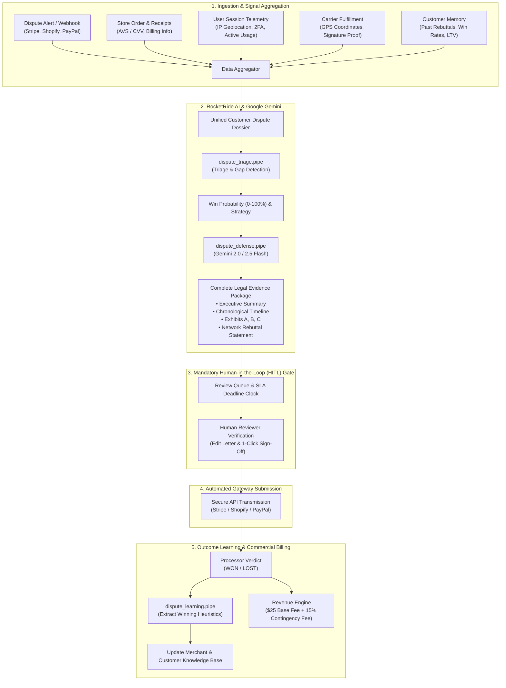

# 🚀 DisputeRocket: Complete Architecture & System Flow Guide

> **DisputeRocket**: Autonomous Payment Dispute Defense & Evidence Packaging Platform  
> **AI Engine**: RocketRide Pipeline Framework + Google Gemini LLM  
> **Target Audience**: SaaS Businesses & E-Commerce Merchants

---

## 📑 Table of Contents

1. [Executive Overview](#1-executive-overview)
2. [End-to-End System Architecture](#2-end-to-end-system-architecture)
3. [The 8-Stage Dispute Lifecycle](#3-the-8-stage-dispute-lifecycle)
4. [RocketRide AI Pipelines (`.pipe` Files)](#4-rocketride-ai-pipelines-pipe-files)
5. [Multi-Source Data Aggregation](#5-multi-source-data-aggregation)
6. [Evidence Synthesis & Exhibits](#6-evidence-synthesis--exhibits)
7. [Mandatory Human-in-the-Loop (HITL) Gate](#7-mandatory-human-in-the-loop-hitl-gate)
8. [Resolution Ingestion & Continual Learning Loop](#8-resolution-ingestion--continual-learning-loop)
9. [Commercial Monetization Engine](#9-commercial-monetization-engine)
10. [Repository Structure & Codebase Map](#10-repository-structure--codebase-map)
11. [Execution & Quickstart Commands](#11-execution--quickstart-commands)

---

## 1. Executive Overview

Online businesses forfeit over **$100 Billion annually** in chargebacks due to three core friction points:
- **Scattered Evidence**: Transaction receipts, AVS/CVV checks, user telemetry (IPs, 2FA logins, active hours), and shipping tracking (GPS, signatures) reside in siloed databases.
- **Strict Gateway Deadlines**: Payment processors (Stripe, PayPal, Shopify) enforce submission cutoffs (often 7–14 days). Missed deadlines result in automatic forfeiture of funds.
- **Generic Rebuttal Statements**: Manual letters lack precise card network rule citations (Visa/Mastercard representment guidelines).
- **Missing Learning Loops**: Post-dispute outcomes (wins/losses) are not indexed into heuristics to improve future defense packs.

**DisputeRocket** resolves these challenges by automating end-to-end ingestion, AI triage, legal evidence synthesis, mandatory human sign-off, direct gateway transmission, and heuristic feedback learning.

---

## 2. End-to-End System Architecture



---

## 3. The 8-Stage Dispute Lifecycle

```
[ Webhook Ingest ] ➔ [ Data Enrichment ] ➔ [ AI Triage ] ➔ [ Evidence Draft ] 
       ▲                                                           │
       └───────────────────────────────────────────────────────────┘
                                   │
                                   ▼
[ Outcome Learning ] ◄── [ Gateway Submit ] ◄── [ Human Review Gate ]
```

### Stage 1: Ingestion & Idempotency
- **Event Intake**: Listens for webhooks (`charge.dispute.created`, `charge.dispute.updated`) or manual overrides.
- **Signature & Idempotency**: Validates cryptographic signatures and creates an immutable `RawWebhookEvent` in the database to prevent duplicate processing.

### Stage 2: Multi-System Correlation
- Correlates order data, billing addresses, AVS/CVV status, 2FA logins, active application hours (SaaS), and carrier tracking/GPS (E-commerce) into a unified defense dossier.

### Stage 3: AI Triage & Evidentiary Gap Analysis
- Evaluates reason codes (e.g. `10.4_FRAUD_CARD_ABSENT`, `13.1_MERCHANDISE_NOT_RECEIVED`).
- Calculates a win probability score and flags missing signals.

### Stage 4: Legal Evidence Synthesis & Exhibits
- Executes `dispute_defense.pipe` using Google Gemini.
- Formats structured exhibits (A, B, C), builds a timestamped chronological audit trail, and drafts a formal representment letter.

### Stage 5: Mandatory Human Review Gate
- In compliance with regulatory and quality standards, every package is queued for human inspection.
- The system monitors deadline SLAs (highlighting `<48h` emergencies) and strictly blocks direct submission until a reviewer signs off.

### Stage 6: Direct Gateway Transmission
- Upon sign-off, transmits the package directly to the processor API (Stripe, PayPal, Shopify) before the statutory deadline.
- Stores an immutable acknowledgment token.

### Stage 7: Resolution & Continual Learning
- Card issuer returns a `WON` or `LOST` verdict.
- `dispute_learning.pipe` extracts successful tactics, updates customer trust scores, and indexes winning heuristics for future disputes.

### Stage 8: Commercial Billing & Ledgering
- Calculates fees: `$25.00` base compilation fee + `15%` contingency fee on recovered funds, providing merchants with a measurable **~4.3x ROI**.

---

## 4. RocketRide AI Pipelines (`.pipe` Files)

DisputeRocket uses 4 dedicated RocketRide pipelines structured as Directed Acyclic Graphs (DAGs) with typed lanes:

| Pipeline File | Source Node | LLM Provider | Output Lane | Primary Purpose |
| :--- | :--- | :--- | :--- | :--- |
| `dispute_defense.pipe` | `chat` | `llm_gemini` (`gemini-2_5-flash`) | `answers` | Compiles full representment package, Exhibits A-C, timeline, and rebuttal letter. |
| `dispute_triage.pipe` | `chat` | `llm_gemini` (`gemini-2_5-flash`) | `answers` | Classifies reason code, calculates win probability (0-100%), and flags evidence gaps. |
| `dispute_learning.pipe` | `chat` | `llm_gemini` (`gemini-2_5-flash`) | `answers` | Analyzes processor verdict and distills winning heuristics into the knowledge base. |
| `chat.pipe` | `chat` | `llm_gemini` (`gemini-2_5-flash`) | `answers` | Interactive Q&A and investigation assistant. |

---

## 5. Multi-Source Data Aggregation

The `DataAggregator` connects 5 signal channels into a unified schema:

1. **Dispute Metadata**: Dispute ID, amount, currency, chargeback reason code, due date.
2. **Order & Authorization**: Payment gateway receipt, itemized cart, card last 4, AVS (Address Verification) and CVV match confirmations.
3. **Session & Security Telemetry**: Origin IP address, device fingerprint, 2FA SMS/Authenticator records, session duration, and active SaaS feature hours.
4. **Fulfillment & Logistics**: Courier tracking code (FedEx/UPS), GPS delivery coordinates, and signature capture.
5. **Customer Historical Memory**: Lifetime value, past dispute outcomes, and historically effective arguments.

---

## 6. Evidence Synthesis & Exhibits

Powered by Google Gemini, DisputeRocket structures legal representment into 3 standard exhibits:

- **Exhibit A (Payment Authorization & Gateway Verification)**:
  Proof of 3D Secure / CVV / AVS matching and cardholder authentication at checkout.
- **Exhibit B (Proof of Service Delivery / Consumption)**:
  - *SaaS*: Authenticated login logs, IP audit trail, and hours of platform usage post-purchase.
  - *E-Commerce*: Carrier proof of delivery with GPS coordinates and signed receipt.
- **Exhibit C (Policy Acceptance & Terms of Service)**:
  Timestamped checkout logs showing explicit acceptance of non-refundable terms and cancellation policies.

---

## 7. Mandatory Human-in-the-Loop (HITL) Gate

The `ReviewManager` guarantees quality control:

- **Pending Queue**: Organizes cases requiring human sign-off.
- **SLA Clock**: Real-time countdown to the processor submission deadline.
- **Rebuttal Editing**: Reviewers can modify letter text or add custom notes.
- **Audit Sign-Off**: Records reviewer name, timestamp, and verification status.
- **Submission Blocker**: Gateway transmission is hard-gated until `is_approved_for_submission == True`.

---

## 8. Resolution Ingestion & Continual Learning Loop

When the card issuer resolves the case:
1. **Outcome Webhook**: Ingests `WON` or `LOST` status with issuer feedback.
2. **AI Analysis**: `dispute_learning.pipe` breaks down why the dispute was won or lost.
3. **Heuristic Extraction**: Distills effective arguments into the merchant knowledge base.
4. **Customer Profiling**: Adjusts the customer's historical risk profile and win-rate score.

---

## 9. Commercial Monetization Engine

$$\text{DisputeRocket Fee} = \text{Base Fee (\$25.00)} + \left(\text{Recovered Capital} \times 15\%\right)$$

### Example Unit Economics ($450 Dispute):
- **Dispute Amount**: $450.00
- **Base Fee**: $25.00
- **Contingency Fee (15%)**: $67.50
- **Total DisputeRocket Fee**: $92.50
- **Merchant Net Recovered Capital**: **$357.50** (Merchant achieves a **4.3x ROI**)

---

## 10. Repository Structure & Codebase Map

```
rocketride2/
├── dispute_core.py             # Main system orchestrator
├── data_aggregator.py          # Multi-source data & telemetry aggregator
├── pipeline_service.py         # RocketRide SDK client & Gemini executor
├── review_manager.py           # Human-in-the-loop review manager & SLA tracker
├── outcome_learner.py          # Feedback loop & heuristic learning engine
├── revenue_engine.py           # Commercial billing & ROI calculator
├── models.py                   # Pydantic domain models & schemas
├── server.py                   # FastAPI REST API & Tailwind web dashboard
├── main.py                     # CLI end-to-end demonstration runner
├── check.py                    # Health check & dry-run validator
│
├── dispute_defense.pipe        # RocketRide AI pipeline: Evidence compilation
├── dispute_triage.pipe         # RocketRide AI pipeline: Triage & win probability
├── dispute_learning.pipe       # RocketRide AI pipeline: Outcome learning
├── chat.pipe                   # RocketRide AI pipeline: General Q&A
│
├── backend/                    # Express + TypeScript + Prisma SQLite server
│   ├── prisma/schema.prisma    # Database schema (Dispute, TelemetrySignal, RawEvents)
│   └── src/
│       ├── index.ts            # Express server entry point (Port 3001)
│       ├── routes/             # Webhooks, Disputes, and Analytics routes
│       └── lib/                # Pipeline normalizers, enrichment, and scoring
│
└── frontend/                   # React + Vite + TypeScript dashboard UI
    └── src/
        ├── App.tsx             # Main interactive operations interface
        └── components/         # Modals, Evidence Studio, Dossiers, and Metrics
```

---

## 11. Execution & Quickstart Commands

### 1. Run Health Checks
```bash
source .venv/bin/activate
python check.py
```

### 2. Run CLI End-to-End Scenario Walkthrough
```bash
python main.py
```

### 3. Launch Python Web Server & Dashboard
```bash
uvicorn server:app --port 8000 --reload
```
- Web Dashboard: `http://localhost:8000`
- Interactive Swagger API Docs: `http://localhost:8000/docs`

### 4. Launch Node.js Backend & React Frontend
```bash
# Start Backend (Port 3001)
cd backend && bun run dev

# Start Frontend (Port 5173)
cd frontend && npm run dev
```
